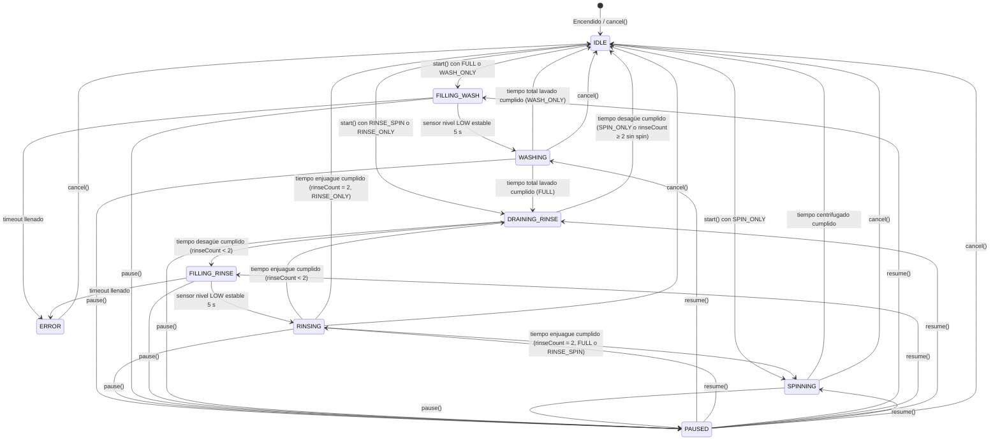
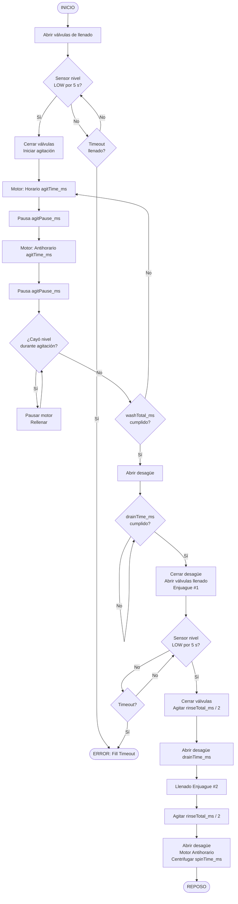
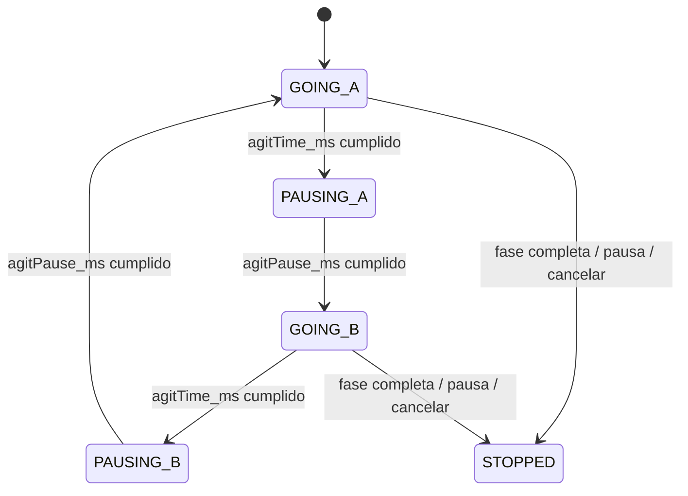
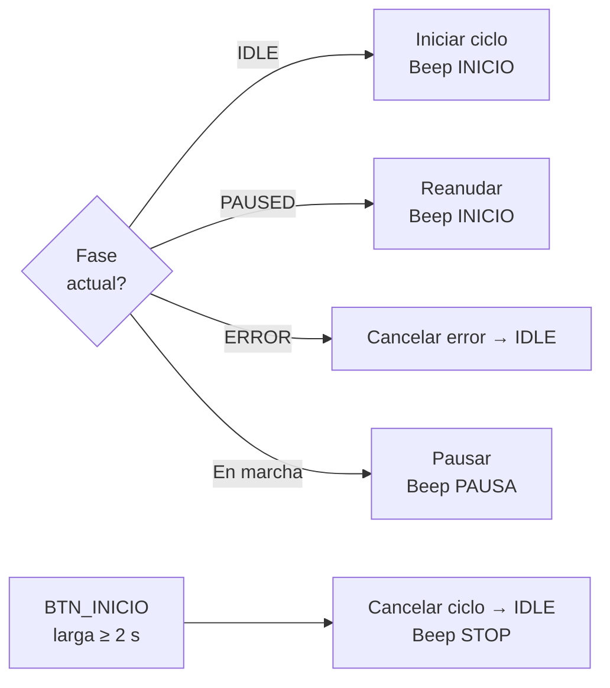
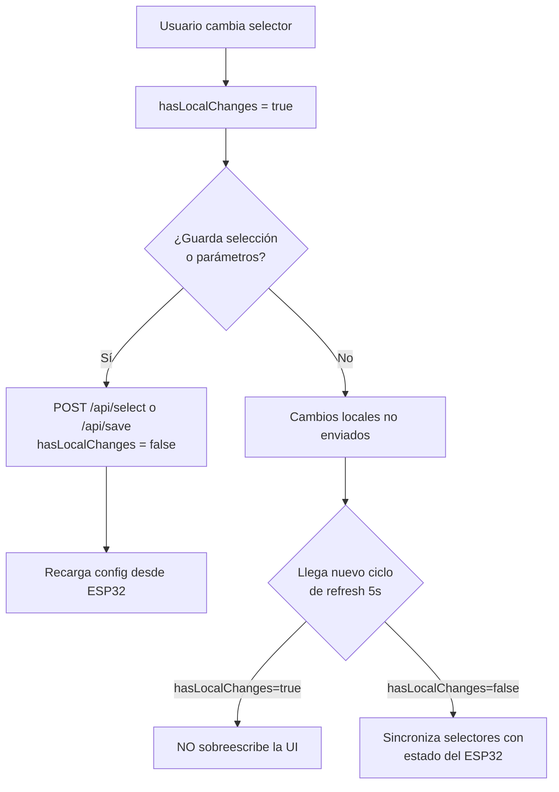
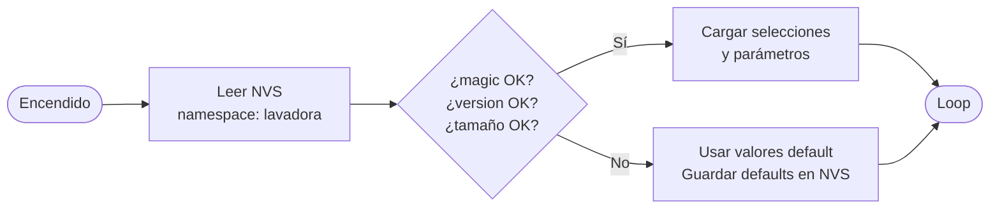

# Manual de Usuario — Lavadora ESP32

> Firmware ESP32 · Fase 5 completa  
> Última revisión: mayo 2026

---

## Índice

1. [Descripción general](#1-descripción-general)
2. [Hardware y conexiones](#2-hardware-y-conexiones)
3. [Modos, ciclos y temperatura del agua](#3-modos-ciclos-y-temperatura-del-agua)
4. [Máquina de estados](#4-máquina-de-estados)
5. [Panel local — botones](#5-panel-local--botones)
6. [Panel local — LEDs indicadores](#6-panel-local--leds-indicadores)
7. [Panel local — buzzer](#7-panel-local--buzzer)
8. [Consola serie (monitor serial)](#8-consola-serie-monitor-serial)
9. [Red WiFi y portal cautivo](#9-red-wifi-y-portal-cautivo)
10. [Página web — interfaz de usuario](#10-página-web--interfaz-de-usuario)
11. [API REST — referencia completa](#11-api-rest--referencia-completa)
12. [Persistencia de configuración (NVS)](#12-persistencia-de-configuración-nvs)
13. [Parámetros por defecto](#13-parámetros-por-defecto)
14. [OLED opcional](#14-oled-opcional)
15. [Casos de uso de ejemplo](#15-casos-de-uso-de-ejemplo)

---

## 1. Descripción general

**Lavadora ESP32** es un controlador inteligente para lavadora implementado sobre un microcontrolador **ESP32**. Gestiona un ciclo completo de lavado mediante una máquina de estados no bloqueante que controla:

- Válvulas de llenado (agua fría / caliente)
- Motor de agitación (sentido horario y antihorario)
- Válvula de desagüe
- Centrifugado (motor antihorario a máxima velocidad)
- Sensor de nivel de agua

El sistema puede operarse de **dos formas independientes o combinadas**:

| Método | Descripción |
|---|---|
| **Panel local** | Tres botones físicos + LEDs + buzzer |
| **Página web** | Interfaz responsive accesible desde cualquier dispositivo conectado al WiFi AP del ESP32 |

Ambos métodos comparten el mismo estado interno: un cambio desde la web se refleja en los LEDs físicos y viceversa.

---

## 2. Hardware y conexiones

### 2.1 Tabla de pines GPIO

| GPIO | Tipo | Nombre | Descripción |
|---|---|---|---|
| 32 | Salida relé | `RELAY_MOTOR_ON` | Alimentación general del motor |
| 33 | Salida relé | `RELAY_HORARIO` | Sentido horario del motor |
| 25 | Salida relé | `RELAY_ANTIHORARIO` | Sentido antihorario del motor |
| 26 | Salida relé | `RELAY_VALVULA_FRIA` | Válvula de agua fría |
| 27 | Salida relé | `RELAY_VALVULA_CALIENTE` | Válvula de agua caliente |
| 14 | Salida relé | `RELAY_DRAIN` | Válvula de desagüe |
| 12 | Salida relé | `RELAY_7` | Libre / reservado |
| 13 | Salida relé / PWM | `RELAY_8` / `BUZZER_PIN` | Libre **y** buzzer (compartido) |
| 4 | Salida LED | `LED_LAVADO` | Indicador fase lavado |
| 5 | Salida LED | `LED_ENJUAGUE` | Indicador fase enjuague |
| 18 | Salida LED | `LED_CENTRIFUGADO` | Indicador centrifugado |
| 19 | Salida LED | `LED_ERROR` | Indicador error / reposo |
| 0 | Salida LED | `LED_AGUA_FRIA` | Indicador agua fría seleccionada |
| 2 | Salida LED | `LED_AGUA_CALIENTE` | Indicador agua caliente seleccionada |
| 15 | Entrada pull-up | `BTN_CICLO` | Botón selección de ciclo |
| 16 | Entrada pull-up | `BTN_MODO` | Botón selección de modo |
| 17 | Entrada pull-up | `BTN_INICIO` | Botón inicio / pausa / cancelar |
| 23 | Entrada pull-up | `SENSOR_NIVEL` | Sensor de nivel de agua |
| 21 | I2C SDA | `OLED_SDA` | Display OLED (opcional) |
| 22 | I2C SCL | `OLED_SCL` | Display OLED (opcional) |

### 2.2 Lógica de activación

| Dispositivo | Activo en | Notas |
|---|---|---|
| Relés | **HIGH** | Módulo de 8 relés estándar |
| LEDs | **LOW** | Cátodo común / corriente a GND |
| Botones | **LOW** | Pull-up interno, se presionan a GND |
| Sensor de nivel | **LOW** | Contacto NA (normalmente abierto). LOW = tina llena |

### 2.3 Motor: conmutación segura

Para evitar cortocircuito entre fases al invertir el motor, la secuencia es:

```
1. Apagar RELAY_MOTOR_ON   (sin alimentación)
2. Configurar RELAY_HORARIO y RELAY_ANTIHORARIO según sentido deseado
3. Encender RELAY_MOTOR_ON  (energizar con nueva dirección)
```

Para **centrifugado**, el motor gira en sentido antihorario a plena velocidad (ambos relés de dirección ON).

---

## 3. Modos, ciclos y temperatura del agua

### 3.1 Ciclos disponibles (`CycleConfig`)

| ID | Nombre | Fases ejecutadas |
|---|---|---|
| 0 | **Lavado + Enjuague + Centrifugado** (FULL) | Llenado → Lavado → Desagüe → Enjuague×2 → Centrifugado |
| 1 | **Enjuague + Centrifugado** (RINSE\_SPIN) | Desagüe inicial → Enjuague×2 → Centrifugado |
| 2 | **Solo Lavado** (WASH\_ONLY) | Llenado → Lavado → Reposo |
| 3 | **Solo Enjuague** (RINSE\_ONLY) | Desagüe inicial → Enjuague×2 → Reposo |
| 4 | **Solo Centrifugado** (SPIN\_ONLY) | Pre-desagüe → Centrifugado → Reposo |

### 3.2 Modos de lavado (`WashMode`)

El modo controla la **intensidad de agitación** (tiempo de giro, pausa y duración total):

| ID | Nombre | Giro por sentido | Pausa entre sentidos | Duración total lavado | Duración total enjuague |
|---|---|---|---|---|---|
| 0 | **Suave** | 3 s | 600 ms | 12 min | ~5.8 min |
| 1 | **Normal** | 5 s | 400 ms | 24 min | ~9.4 min |
| 2 | **Fuerte** | 8 s | 300 ms | ~46 min | ~14.3 min |
| 3 | **Muy Fuerte** | 12 s | 300 ms | ~82 min | ~23.6 min |

> Los tiempos exactos se pueden modificar desde la página web y se persisten en flash (NVS). Ver [Sección 13](#13-parámetros-por-defecto) para la tabla completa de defaults.

### 3.3 Temperatura del agua (`WaterFillMode`)

| ID | Nombre | Válvula fría | Válvula caliente |
|---|---|---|---|
| 0 | **Fría** | ON | OFF |
| 1 | **Caliente** | OFF | ON |
| 2 | **Ambas** | ON | ON |

---

## 4. Máquina de estados

### 4.1 Diagrama de fases



### 4.2 Flujo detallado — Ciclo FULL (Lavado + Enjuague + Centrifugado)



### 4.3 Sub-estados del motor durante agitación (`MotorPhase`)



### 4.4 Centrifugado — pre-desagüe

El centrifugado siempre incluye una etapa inicial de **pre-desagüe** antes de arrancar el motor:

```
1. Abrir válvula de desagüe   (drainTime_ms)
2. Cerrar desagüe             
3. Arrancar motor antihorario + mantener desagüe abierto  (spinTime_ms)
4. Apagar motor y cerrar desagüe → IDLE
```

### 4.5 Relleno automático durante agitación

Si el sensor de nivel deja de detectar agua **durante el lavado o enjuague**, el sistema:

1. Para el motor inmediatamente.
2. Congela el contador de tiempo de la fase.
3. Abre las válvulas de llenado.
4. Espera a que el nivel suba y se estabilice 5 s.
5. Reanuda la agitación exactamente donde se quedó.

Si el relleno tarda más que `fillTimeout_ms` → error `FILL_TIMEOUT`.

### 4.6 Pausa y reanudación

Al pausar:
- Motor, válvulas y desagüe se apagan de inmediato.
- Se guarda la fase y sub-estado del motor (`_pausedPhase`, `_pausedMotorPhase`).

Al reanudar:
- Se compensa el tiempo que estuvo pausado sumándolo a `_phaseStart` y `_motorStart`.
- Se restauran las salidas de hardware según la fase guardada.
- El ciclo continúa exactamente desde donde se detuvo.

---

## 5. Panel local — botones

### 5.1 Tabla de funciones

| Botón | Pulsación corta | Pulsación larga (≥ 2 s) | Combo simultáneo |
|---|---|---|---|
| `BTN_CICLO` (GPIO 15) | Siguiente ciclo *(solo en reposo)* | — | — |
| `BTN_MODO` (GPIO 16) | Siguiente modo *(solo en reposo)* | — | — |
| `BTN_INICIO` (GPIO 17) | Iniciar / Pausar / Reanudar / Cancelar error | **Cancelar ciclo** en curso | — |
| `BTN_CICLO` + `BTN_MODO` | — | — | Siguiente temperatura de agua *(solo en reposo)* |

> **Debounce:** 50 ms de estabilización antes de registrar un cambio de estado.  
> **Prioridad alerta de fin:** Cuando el buzzer de finalización está activo, **cualquier pulsación** simplemente apaga la alerta sin ejecutar otra acción.

### 5.2 Comportamiento de BTN\_INICIO según fase



### 5.3 Cambio de temperatura — combo botones

Presionar simultáneamente `BTN_CICLO` y `BTN_MODO` **avanza** a la siguiente temperatura en el orden:

```
Fría → Caliente → Ambas → Fría → ...
```

- Solo funciona cuando la lavadora está en **reposo**.
- El combo dispara **una sola vez por presión** (latch): debe soltar y volver a presionar para cambiar de nuevo.
- Presionar el combo también cancela la alerta de finalización si estuviera activa.

En el panel esto significa que **no existe un botón dedicado para el agua**: para cambiar entre agua fría, caliente o ambas debes presionar **al mismo tiempo** los botones **CICLO** y **MODO**.

### 5.4 Vista previa de modo en LEDs

Tras presionar `BTN_MODO`, los **3 LEDs superiores de selección** muestran el modo seleccionado durante **3 segundos** usando el patrón:

- LED izquierdo = referencia de intensidad máxima
- LED del medio = referencia del modo medio
- LED derecho = referencia del modo suave

Interpretación visual para el usuario:

| Modo | LED Lavado | LED Enjuague | LED Centrifugado | LED Error |
|---|---|---|---|---|
| Suave | OFF | OFF | ON | Parpadea |
| Medio (internamente `Normal`) | OFF | ON | OFF | Parpadea |
| Fuerte | OFF | ON | ON | Parpadea |
| Muy Fuerte | ON | ON | ON | Parpadea |

Es decir:

- Si se enciende solo el LED más a la derecha, el modo es **Suave**
- Si se enciende solo el LED del medio, el modo es **Medio**
- Si se encienden el LED del medio y el de la derecha, el modo es **Fuerte**
- Si se encienden los 3 LEDs, el modo es **Muy Fuerte**

Transcurridos 3 s, los LEDs vuelven a mostrar el ciclo seleccionado.

---

## 6. Panel local — LEDs indicadores

> Los LEDs son activos en **LOW** (encendido = `digitalWrite(pin, LOW)`).  
> Tasa de parpadeo normal: **400 ms** (2.5 Hz).  
> Tasa de parpadeo LEDs de agua: **300 ms** (3.3 Hz).

### 6.1 LEDs de fase (Lavado, Enjuague, Centrifugado, Error)

#### En reposo (IDLE)

Los **3 LEDs superiores de selección de ciclo** se leen así:

- LED izquierdo = **Lavado**
- LED del medio = **Enjuague**
- LED derecho = **Centrifugado**

En reposo muestran las fases **incluidas** en el ciclo seleccionado:

| Ciclo | Lavado | Enjuague | Centrifugado | Error |
|---|---|---|---|---|
| FULL | ON | ON | ON | ON |
| Enjuague+Centrifugado | OFF | ON | ON | ON |
| Solo Lavado | ON | OFF | OFF | ON |
| Solo Enjuague | OFF | ON | OFF | ON |
| Solo Centrifugado | OFF | OFF | ON | ON |

> El LED de Error encendido en reposo funciona como **indicador de "listo"**.

Lectura rápida para el usuario:

- **Lavado + Enjuague + Centrifugado**: se encienden los 3 LEDs
- **Enjuague + Centrifugado**: se encienden el LED del medio y el derecho
- **Solo Lavado**: se enciende solo el LED izquierdo
- **Solo Enjuague**: se enciende solo el LED del medio
- **Solo Centrifugado**: se enciende solo el LED derecho

#### Durante el ciclo

| Fase activa | Lavado | Enjuague | Centrifugado | Error |
|---|---|---|---|---|
| Llenando para lavado | Parpadea | Steady (si FULL) | Steady (si FULL) | OFF |
| Lavando | Parpadea | Steady (si FULL) | Steady (si FULL) | OFF |
| Desaguando (post-lavado) | Parpadea | Steady (si FULL) | Steady (si FULL) | OFF |
| Llenando para enjuague | OFF | Parpadea | Steady (si FULL o R+C) | OFF |
| Enjuagando | OFF | Parpadea | Steady (si FULL o R+C) | OFF |
| Desaguando (post-enjuague) | OFF | Parpadea | Steady (si FULL o R+C) | OFF |
| Centrifugando | OFF | OFF | Parpadea | OFF |
| Pausado | Parpadea | Parpadea | Parpadea | Parpadea |
| Error | OFF | OFF | OFF | Parpadea |

#### Alerta de finalización

Al terminar el ciclo, **todos los LEDs** (incluyendo los de agua) parpadean en sincronía con el buzzer: 3 s encendidos, 2 s apagados, durante 10 repeticiones (~50 s total).  
Cualquier botón o la web cancelan la alerta.

### 6.2 LEDs de agua (Fría / Caliente)

| Situación | LED Agua Fría | LED Agua Caliente |
|---|---|---|
| Selección: Fría | ON | OFF |
| Selección: Caliente | OFF | ON |
| Selección: Ambas | ON | ON |
| Llenando (válvulas abiertas) | Parpadea si aplica | Parpadea si aplica |
| Error de llenado (timeout) | Parpadea | Parpadea |

---

## 7. Panel local — buzzer

El buzzer usa el canal **LEDC 0** del ESP32 (PWM por hardware, no bloqueante).

### 7.1 Patrones de señal acústica

| Evento | Patrón | Descripción |
|---|---|---|
| **Inicio / Reanudación** | 2200 Hz × 70 ms · silencio 30 ms | 1 pitido corto agudo |
| **Pausa** | 1800 Hz × 60 ms · silencio 40 ms · 1800 Hz × 60 ms | 2 pitidos medios |
| **Cancelar** | 1200 Hz × 160 ms | 1 pitido grave |
| **Error** | 900 Hz×140 ms · silencio 50 ms · 700 Hz×140 ms · silencio 50 ms · 900 Hz×140 ms | 3 pitidos descendentes |
| **Fin de ciclo** | 2200 Hz × 3 s · silencio 2 s — **10 repeticiones** (~50 s) | Alerta larga intermitente |

> Los patrones son **no bloqueantes**: se ejecutan en segundo plano sin pausar el `loop()`.

---

## 8. Consola serie (monitor serial)

El ESP32 expone una consola de depuración en **UART0 a 115200 bps**.  
Conectar un adaptador USB-TTL a TX (GPIO 1) y RX (GPIO 3).

### 8.1 Comandos disponibles

| Tecla | Acción |
|---|---|
| `G` | Iniciar ciclo (con los parámetros actualmente seleccionados) |
| `P` | Pausar si está corriendo / Reanudar si está pausado |
| `S` | Cancelar ciclo y volver a reposo |
| `+` | Avanzar al siguiente ciclo *(solo en reposo)* |
| `*` | Avanzar al siguiente modo *(solo en reposo)* |
| `D` | Mostrar estado actual |
| `T` | Mostrar tiempos configurados para todos los modos |
| `?` | Mostrar menú de ayuda |

### 8.2 Ejemplos de salida

**Estado en marcha (`D`):**
```
[Lavando] Normal | Lavado+Enjuague+Centrifugado | 1234 s restantes | agit transcurrido: 48200 ms
```

**Tiempos de modo (`T`):**
```
--- TIEMPOS POR MODO ---
Suave   | total 43 s, Lavado: giro 3000 ms, pausa 600 ms,  | Enjuague: total 20 s, giro 2000 ms | Spin: 300 s | Drenaje: 180 s | Llenado TO: 180 s
Normal  | total 86 s, Lavado: giro 5000 ms, pausa 400 ms,  | Enjuague: total 34 s, giro 3000 ms | Spin: 360 s | Drenaje: 180 s | Llenado TO: 180 s
...
```

**Mensajes de eventos:**
```
INICIANDO - Lavado+Enjuague+Centrifugado / Normal / Agua: Ambas
PAUSADO (mantener 2 s para cancelar)
REANUDANDO
CANCELADO
Agua: Fria
Ciclo: Solo Lavado
Modo: Fuerte
Error cancelado (Timeout de llenado). Listo.
```

---

## 9. Red WiFi y portal cautivo

### 9.1 Parámetros de acceso

| Parámetro | Valor |
|---|---|
| SSID | `Lavadora-ESP32` |
| Contraseña | `esp32wifi` |
| Dirección IP | `4.3.2.1` |
| Máscara de subred | `255.255.255.0` |
| Modo | AP (Access Point) — no necesita internet |

### 9.2 Portal cautivo

El ESP32 corre un servidor DNS que responde **todas las consultas** con su propia IP (`4.3.2.1`). Cuando un dispositivo (teléfono, tablet, PC) se conecta a la red WiFi, el sistema operativo detecta automáticamente el portal y abre el navegador.

El nombre de la red y la clave se pueden cambiar muy fácilmente editando los `#define` `WIFI_AP_SSID` y `WIFI_AP_PASSWORD` al inicio de [include/config.h](include/config.h). No hace falta modificar la lógica del programa: basta con cambiar esos textos por los que desees.

Rutas de detección de portal cautivo soportadas:
- `/generate_204` (Android)
- `/hotspot-detect.html` (iOS/macOS)
- `/ncsi.txt` y `/connecttest.txt` (Windows)
- Cualquier otra URL no reconocida → redirige a `/`

### 9.3 Cómo conectarse

```
1. Activar WiFi en el dispositivo
2. Buscar la red "Lavadora-ESP32"
3. Conectar con la contraseña: esp32wifi
4. El navegador se abrirá automáticamente (portal cautivo)
   — Si no: abrir http://4.3.2.1 manualmente
```

---

## 10. Página web — interfaz de usuario

La página web es una aplicación de página única (SPA) completamente embebida en el firmware. Se actualiza automáticamente cada **1.5 segundos** (estado) y cada **5 segundos** (configuración).

### 10.1 Sección Hero (cabecera de estado)

```
┌─────────────────────────────────────────────────────┐
│  Lavando                          ← Fase activa     │
│                                                      │
│  Tiempo restante total │ Tiempo ciclo actual         │
│        42m 15s         │       18m 03s               │
│                                                      │
│  Nivel de agua │ Estado            │ (Detalle error) │
│    Lleno       │ Enjuagando        │                 │
└─────────────────────────────────────────────────────┘
```

| Campo | Descripción |
|---|---|
| **Fase activa** | Texto grande: fase actual con sub-estado (p.ej. "Lavado (Llenando)") |
| **Tiempo restante total** | En reposo: estimación basada en los parámetros del ciclo/modo seleccionados. En marcha: tiempo calculado de lo que resta del ciclo completo |
| **Tiempo ciclo actual** | Tiempo restante de la fase actual solamente |
| **Nivel de agua** | `Lleno` (sensor LOW) o `Vacío` (sensor HIGH) |
| **Estado** | Texto descriptivo: "Lista para iniciar", nombre de la fase activa, "Proceso pausado en …", o "Proceso detenido por error" |
| **Detalle error** | Visible solo en estado ERROR. Texto en rojo con la causa |

### 10.2 Tarjeta "Control"

```
┌────────────────────────────────────────────────────────────┐
│  Control                                                   │
│                                                            │
│  Ciclos / Modos                    led status              │
│    ●   ●   ●                          ●                    │
│                                                            │
│  agua fria / caliente                                      │
│    ●       ●                                               │
│                                                            │
│     ┌──────────────┐       ┌──────────────┐                │
│     │   Modo [▼]   │       │  Ciclo [▼]   │                │
│     └──────────────┘       └──────────────┘                │
│                                                            │
│                              ┌──────────────┐              │
│                              │   Agua [▼]   │              │
│                              └──────────────┘              │
│                                                            │
│     ┌──────────────┐       ┌──────────────┐                │
│     │[Guardar selec]│      │ [Cancelar]   │                │
│     └──────────────┘       └──────────────┘                │
│                                                            │
│                              ┌──────────────┐              │
│                              │  [Iniciar]   │              │
│                              └──────────────┘              │
│                              ┌──────────────┐              │
│                              │[Pausa/Reanud]│              │
│                              └──────────────┘              │
│                                                            │
│  ℹ Proceso iniciado: para cambiar parametros primero       │
│    debes cancelar el ciclo en curso.                       │
└────────────────────────────────────────────────────────────┘
```

Este dibujo no representa el cableado interno ni el tamaño exacto del panel, pero sí busca parecerse a la **distribución visual real**: indicadores en la parte superior, luces de agua debajo, botones **MODO** y **CICLO** en el centro y la acción principal de **START/STOP** hacia la parte derecha.

| Control | Función |
|---|---|
| **Selector Ciclo** | Desplegable con los 5 ciclos disponibles |
| **Selector Modo** | Desplegable con los 4 modos de lavado |
| **Selector Agua** | Desplegable con Fría / Caliente / Ambas |
| **Botón Iniciar** | Envía ciclo+modo+agua y arranca. Deshabilitado si no está en reposo |
| **Botón Pausar/Reanudar** | Pausa si está corriendo, reanuda si está pausado |
| **Botón Guardar selección** | Guarda ciclo+modo+agua en flash (NVS) sin iniciar; esa será la configuración con la que la lavadora arrancará por defecto al volver a energizarse |
| **Botón Cancelar** | Cancela el ciclo en curso y vuelve a reposo |
| **Mensaje de bloqueo** | Aparece cuando hay un ciclo activo: los controles de edición se deshabilitan |

> **Bloqueo de edición:** Mientras la lavadora está funcionando, los selectores y campos de parámetros quedan **deshabilitados** (`disabled`). Solo el botón Iniciar y las acciones de control siguen activos.

En la práctica, **Guardar selección** sirve para dejar preparado el arranque habitual de la lavadora. Si guardas un ciclo, un modo y un tipo de agua, la próxima vez que energices el equipo esa misma combinación quedará cargada automáticamente y, si no deseas cambiar nada, solo hará falta presionar **Iniciar**.

### 10.3 Tarjeta "Parámetros por modo"

```
┌─────────────────────────────────────────────────────┐
│  Parámetros por modo                                 │
│  ┌──────────────────────┐  ┌───────────────────────┐│
│  │ Lavado: tiempo total │  │ Lavado: giro/sentido  ││
│  │  [  86400  ] ms      │  │  [  5000  ] ms        ││
│  └──────────────────────┘  └───────────────────────┘│
│  ┌──────────────────────┐  ┌───────────────────────┐│
│  │ Enjuague: total      │  │ Enjuague: giro/sentido││
│  │  [  34000  ] ms      │  │  [  3000  ] ms        ││
│  └──────────────────────┘  └───────────────────────┘│
│  ┌──────────────────────┐  ┌───────────────────────┐│
│  │ Centrifugado total   │  │ Desagüe               ││
│  │  [ 360000  ] ms      │  │  [ 180000 ] ms        ││
│  └──────────────────────┘  └───────────────────────┘│
│  ┌──────────────────────┐  ┌───────────────────────┐│
│  │ Pausa entre sentidos │  │ Timeout llenado       ││
│  │  [   400   ] ms      │  │  [ 180000 ] ms        ││
│  └──────────────────────┘  └───────────────────────┘│
│  Guía rápida: 1000 ms = 1 s. …                      │
│           [Guardar parámetros del modo]              │
└─────────────────────────────────────────────────────┘
```

Los parámetros mostrados corresponden al **modo actualmente seleccionado** en el selector. Al cambiar el selector de modo, los campos se actualizan automáticamente.

Esto significa que los tiempos se configuran **por separado para cada modo de lavado**:

- **Suave**
- **Medio** (internamente `Normal`)
- **Fuerte**
- **Muy Fuerte**

Por ejemplo, puedes dejar tiempos cortos para **Suave**, tiempos intermedios para **Medio** y tiempos más largos para **Fuerte** o **Muy Fuerte**. Si modificas los tiempos de un modo, **solo cambias ese modo** y no los demás.

| Campo | Parámetro interno | Descripción |
|---|---|---|
| Lavado: tiempo total | `washTotal_ms` | Duración total de la fase de lavado |
| Lavado: giro por sentido | `agitTime_ms` | Tiempo que gira en cada dirección |
| Enjuague: tiempo total | `rinseTotal_ms` | Duración total de los dos enjuagues combinados |
| Enjuague: giro por sentido | `rinseAgitTime_ms` | Tiempo de giro en cada dirección durante enjuague |
| Centrifugado total | `spinTime_ms` | Duración del centrifugado |
| Desagüe | `drainTime_ms` | Tiempo abierto cada válvula de desagüe |
| Pausa entre sentidos | `agitPause_ms` | Tiempo de reposo del motor al cambiar de dirección |
| Timeout llenado | `fillTimeout_ms` | Tiempo máximo para alcanzar el nivel antes de error |

> **Los parámetros son por modo, no por ciclo.** Modificar "Medio / Normal" afecta a cualquier ciclo que se ejecute en ese modo, pero no cambia Suave, Fuerte ni Muy Fuerte.

### 10.4 Comportamiento de los selectores (sincronización)



Esto permite que el usuario **edite libremente** los selectores sin que el refresco automático pise sus cambios mientras no los haya guardado.

### 10.5 Notificaciones toast

Mensajes emergentes en la esquina inferior derecha, 1.8 s de duración:

| Color | Evento |
|---|---|
| Verde | Selección guardada / Parámetros guardados |
| Rojo | Error al guardar / proceso en marcha |

---

## 11. API REST — referencia completa

Todos los endpoints están en `http://4.3.2.1/api/…`  
Las respuestas son JSON. Los `POST` reciben `application/x-www-form-urlencoded`.

### 11.1 `GET /api/status`

Devuelve el estado completo en tiempo real.

**Ejemplo de respuesta:**
```json
{
  "phase": "Lavando",
  "activePhase": "Lavando",
  "running": true,
  "canEdit": false,
  "mode": 1,
  "cycle": 0,
  "selectedMode": 1,
  "selectedCycle": 0,
  "selectedWater": 2,
  "remainingMs": 74200,
  "remainingPhaseMs": 74200,
  "remainingTotalMs": 320000,
  "agitElapsedMs": 12000,
  "error": 0,
  "errorLabel": "Sin error",
  "waterFull": true
}
```

| Campo | Tipo | Descripción |
|---|---|---|
| `phase` | string | Nombre de la fase activa (ver tabla de fases) |
| `activePhase` | string | Igual que `phase` excepto en PAUSED, donde muestra la fase pausada |
| `running` | bool | `true` si hay un ciclo activo (no IDLE, no PAUSED, no ERROR) |
| `canEdit` | bool | `true` solo en IDLE — los controles de edición se habilitan |
| `mode` | int | Modo actual del ciclo corriendo (0–3) |
| `cycle` | int | Ciclo actual del ciclo corriendo (0–4) |
| `selectedMode` | int | Modo **seleccionado** para la próxima ejecución |
| `selectedCycle` | int | Ciclo **seleccionado** para la próxima ejecución |
| `selectedWater` | int | Temperatura de agua seleccionada (0=Fría, 1=Caliente, 2=Ambas) |
| `remainingMs` | int | Ms restantes en la fase actual |
| `remainingPhaseMs` | int | Igual que `remainingMs` |
| `remainingTotalMs` | int | Ms estimados hasta el final del ciclo completo |
| `agitElapsedMs` | int | Ms transcurridos en la fase de agitación actual (0 si no está agitando) |
| `error` | int | Código de error: 0=ninguno, 1=FILL_TIMEOUT |
| `errorLabel` | string | Descripción textual del error |
| `waterFull` | bool | `true` si el sensor de nivel está en LOW (tina llena) |

---

### 11.2 `GET /api/config`

Devuelve la configuración guardada: selecciones actuales y parámetros de todos los modos.

**Ejemplo de respuesta:**
```json
{
  "selectedMode": 1,
  "selectedCycle": 0,
  "selectedWater": 2,
  "modes": [
    {
      "id": 0, "label": "Suave",
      "agit": 3000, "pause": 600, "wtime": 43200,
      "rtime": 2000, "rtimeTotal": 20800,
      "spin": 300000, "drain": 180000, "fill": 180000
    },
    { "id": 1, "label": "Normal", "agit": 5000, "pause": 400, "wtime": 86400, ... },
    { "id": 2, "label": "Fuerte", ... },
    { "id": 3, "label": "Muy Fuerte", ... }
  ],
  "waters": [
    {"id": 0, "label": "Fria"},
    {"id": 1, "label": "Caliente"},
    {"id": 2, "label": "Ambas"}
  ],
  "cycles": [
    {"id": 0, "label": "Lavado+Enjuague+Centrifugado"},
    {"id": 1, "label": "Enjuague+Centrifugado"},
    {"id": 2, "label": "Solo Lavado"},
    {"id": 3, "label": "Solo Enjuague"},
    {"id": 4, "label": "Solo Centrifugado"}
  ]
}
```

---

### 11.3 `POST /api/start`

Inicia un ciclo. Acepta opcionalmente cycle, mode y water para cambiarlos antes de arrancar.

**Parámetros (todos opcionales):**

| Parámetro | Tipo | Descripción |
|---|---|---|
| `cycle` | int (0–4) | Ciclo a ejecutar |
| `mode` | int (0–3) | Modo de lavado |
| `water` | int (0–2) | Temperatura del agua |

**Respuestas:**
- `200 {"ok": true}` — ciclo iniciado
- `409 {"ok": false}` — ya hay un ciclo en marcha

**Ejemplo con `curl`:**
```bash
curl -X POST http://4.3.2.1/api/start \
  -d "cycle=0&mode=1&water=2"
```

---

### 11.4 `POST /api/pause`

Pausa el ciclo en curso.

**Respuesta:** `200 {"ok": true}`

---

### 11.5 `POST /api/resume`

Reanuda el ciclo pausado.

**Respuesta:** `200 {"ok": true}`

---

### 11.6 `POST /api/cancel`

Cancela el ciclo actual. Lleva la máquina a IDLE.

**Respuesta:** `200 {"ok": true}`

---

### 11.7 `POST /api/select`

Cambia ciclo, modo y/o temperatura de agua **sin iniciar**. Guarda en NVS.  
Solo disponible en IDLE.

**Parámetros (todos opcionales):**

| Parámetro | Tipo | Descripción |
|---|---|---|
| `cycle` | int (0–4) | Ciclo a preseleccionar |
| `mode` | int (0–3) | Modo de lavado a preseleccionar |
| `water` | int (0–2) | Temperatura a preseleccionar |

**Respuestas:**
- `200 {"ok": true}` — guardado
- `409 {"ok": false, "error": "locked_until_cancel"}` — lavadora en marcha

---

### 11.8 `POST /api/save`

Modifica los **parámetros temporales de un modo específico** y los guarda en NVS.  
Solo disponible en IDLE. El parámetro `mode` es obligatorio.

**Parámetros:**

| Parámetro | Obligatorio | Tipo | Descripción |
|---|---|---|---|
| `mode` | **Sí** | int (0–3) | Modo a modificar |
| `agit` | No | int (ms) | Tiempo de giro por sentido en lavado |
| `pause` | No | int (ms) | Pausa entre cambios de sentido |
| `wtime` | No | int (ms) | Tiempo total de lavado |
| `rtime` | No | int (ms) | Tiempo de giro por sentido en enjuague |
| `rtimeTotal` | No | int (ms) | Tiempo total de enjuague (2 ciclos combinados) |
| `spin` | No | int (ms) | Tiempo total de centrifugado |
| `drain` | No | int (ms) | Tiempo de desagüe |
| `fill` | No | int (ms) | Timeout máximo de llenado |

**Respuestas:**
- `200 {"ok": true}` — guardado
- `400 {"ok": false, "error": "mode_required"}` — falta el parámetro `mode`
- `400 {"ok": false, "error": "mode_invalid"}` — valor de `mode` fuera de rango
- `409 {"ok": false, "error": "locked_until_cancel"}` — lavadora en marcha

**Ejemplo — Ajustar lavado Normal a 30 min y centrifugado a 10 min:**
```bash
curl -X POST http://4.3.2.1/api/save \
  -d "mode=1&wtime=1800000&spin=600000"
```

---

## 12. Persistencia de configuración (NVS)

El firmware usa la librería `Preferences` del ESP32 para guardar en flash **no volátil** (NVS — Non-Volatile Storage):

- Modo seleccionado
- Ciclo seleccionado
- Temperatura de agua seleccionada
- Todos los parámetros de los 4 modos

### 12.1 Estructura almacenada

```cpp
struct PersistedConfig {
    uint32_t magic;    // 0x4C564A53 ("LVJS") — identifica datos válidos
    uint16_t version;  // 2 — si cambia la estructura, invalida datos viejos
    uint8_t  mode;
    uint8_t  cycle;
    uint8_t  water;
    WashParams params[4];  // parámetros de SOFT, NORMAL, STRONG, XSTRONG
};
```

### 12.2 Comportamiento al arrancar



Si la estructura cambia en una futura versión del firmware (p.ej. se añade un parámetro), el número de `version` aumentará y se resetearán automáticamente los parámetros a los nuevos defaults, evitando lecturas corruptas.

### 12.3 Cuándo se guarda

| Acción | Guarda en NVS |
|---|---|
| `POST /api/select` | Sí — ciclo, modo y agua |
| `POST /api/save` | Sí — parámetros del modo indicado |
| Botones físicos | **No** — los cambios de los botones son solo en RAM hasta que se use la web |
| Inicio de ciclo (`/api/start`) | **No** — modificar la selección sí, pero no los parámetros |

> **Importante:** Los cambios de ciclo/modo/agua hechos **solo con botones físicos** se perderán al reiniciar si no se guardan desde la web con "Guardar selección". Al usar **Guardar selección**, esa combinación queda como configuración predeterminada para el siguiente encendido.

---

## 13. Parámetros por defecto

Tabla completa de `DEFAULT_PARAMS`:

| Parámetro | Suave | Normal | Fuerte | Muy Fuerte |
|---|---|---|---|---|
| `agitTime_ms` | 3 000 ms (3 s) | 5 000 ms (5 s) | 8 000 ms (8 s) | 12 000 ms (12 s) |
| `agitPause_ms` | 600 ms | 400 ms | 300 ms | 300 ms |
| `washTotal_ms` | 43 200 ms (12 min) | 86 400 ms (24 min) | 166 000 ms (~46 min) | 295 200 ms (~82 min) |
| `rinseAgitTime_ms` | 2 000 ms (2 s) | 3 000 ms (3 s) | 4 000 ms (4 s) | 5 000 ms (5 s) |
| `rinseTotal_ms` | 20 800 ms (~5.8 min) | 34 000 ms (~9.4 min) | 51 600 ms (~14.3 min) | 84 800 ms (~23.6 min) |
| `spinTime_ms` | 300 000 ms (5 min) | 360 000 ms (6 min) | 420 000 ms (7 min) | 480 000 ms (8 min) |
| `drainTime_ms` | 180 000 ms (3 min) | 180 000 ms (3 min) | 180 000 ms (3 min) | 180 000 ms (3 min) |
| `fillTimeout_ms` | 180 000 ms (3 min) | 180 000 ms (3 min) | 180 000 ms (3 min) | 180 000 ms (3 min) |

### 13.1 Duración estimada por ciclo

> Ciclo FULL con 2 enjuagues. El llenado se asume instantáneo (sensor detecta nivel); el timeout es el peor caso.

| Modo | Duración aproximada |
|---|---|
| Suave | ~35 min |
| Normal | ~55 min |
| Fuerte | ~90 min |
| Muy Fuerte | ~140 min |

> El tiempo exacto depende de cuánto tarda el agua en llenar la tina.

---

## 14. OLED opcional

Si se compila con el flag `-D USE_OLED`, se activa un display OLED **SSD1306 de 128×64 px** por I2C.

- **SDA:** GPIO 21  
- **SCL:** GPIO 22  
- **Dirección I2C:** `0x3C`
- **Actualización:** cada 500 ms

**Contenido mostrado (6 líneas):**
```
Lavadora ESP32
Fase: Lavando
Modo: Normal
Ciclo:Lavado+Enjuague+Centrifugado
Rem:1234s
Agua:Llena
```

Si el OLED no está físicamente conectado, el firmware continúa funcionando normalmente (detecta fallo en `begin()` y omite las actualizaciones).

---

## 15. Casos de uso de ejemplo

### Caso 1 — Lavado completo rápido desde el panel

```
1. Presionar BTN_CICLO hasta que LED_LAVADO, LED_ENJUAGUE y LED_CENTRIFUGADO estén encendidos
   → Ciclo: FULL
2. Presionar BTN_MODO hasta que solo LED_ENJUAGUE esté encendido (vista previa)
   → Modo: Normal
3. Verificar LEDs de agua: ambos encendidos = Ambas
4. Presionar BTN_INICIO (pulsación corta)
   → Beep corto, comienza a llenar
5. Esperar finalización: todos los LEDs parpadean + buzzer largo
6. Presionar cualquier botón para apagar la alerta
```

### Caso 2 — Solo centrifugado desde la web

```
1. Conectar al WiFi "Lavadora-ESP32" con contraseña "esp32wifi"
2. Abrir http://4.3.2.1
3. En el selector Ciclo → elegir "Solo Centrifugado"
4. Pulsar "Iniciar"
5. Observar en la cabecera: "Centrifugado (Desaguando)" → "Centrifugando"
```

### Caso 3 — Ajustar duración del centrifugado para modo Normal

```
1. Abrir la página web
2. En el selector "Modo" del panel Parámetros → elegir "Normal"
3. En el campo "Centrifugado total (ms)" → escribir 480000 (8 minutos)
4. Pulsar "Guardar parámetros del modo"
5. Toast verde: "Parametros guardados"
6. El cambio persiste después de reiniciar el ESP32
```

### Caso 4 — Pausa de emergencia y reanudación

```
Panel físico:
  BTN_INICIO (pulsación corta) → PAUSADO, todos los LEDs parpadean, beep doble
  BTN_INICIO (pulsación corta) → REANUDA, beep corto, continúa desde donde estaba

Desde la web:
  Botón "Pausar/Reanudar" → pausa
  Botón "Pausar/Reanudar" → reanuda
```

### Caso 5 — Cambiar a agua fría desde los botones

```
1. Lavadora en reposo
2. Mantener BTN_CICLO y BTN_MODO presionados simultáneamente
3. Los LEDs de agua cambian: Ambas → Fría (solo LED azul)
4. Soltar y volver a presionar para seguir ciclando: Fría → Caliente → Ambas
```

### Caso 6 — Diagnóstico de error de llenado

```
Síntoma:
  LED_ERROR parpadea solo
  LEDs de agua fría y caliente parpadean rápido (300 ms)
  En la web: campo Detalle → "Error de llenado: no se alcanzo el nivel de agua a tiempo"

Solución:
  1. Verificar que hay suministro de agua
  2. Revisar que el sensor de nivel esté conectado correctamente
  3. En la web (o BTN_INICIO), cancelar el error → vuelve a IDLE
  4. Opcionalmente aumentar fillTimeout_ms en Parámetros por modo
```

---

## Apéndice — Tabla de fases con etiquetas

| `CyclePhase` | Etiqueta mostrada | Relés activos |
|---|---|---|
| `IDLE` | Reposo | Ninguno |
| `FILLING_WASH` | Lavado (Llenando) | Válvulas agua |
| `WASHING` | Lavando | Motor (alternando) |
| `DRAINING_WASH` | — (no usado en flujo actual) | Desagüe |
| `FILLING_RINSE` | Enjuague (Llenando) | Válvulas agua |
| `RINSING` | Enjuagando | Motor (alternando) |
| `DRAINING_RINSE` | Enjuague (Desaguando) | Desagüe |
| `SPINNING` | Centrifugando | Motor antihorario + Desagüe |
| `PAUSED` | Pausado | Ninguno |
| `ERROR` | ERROR | Ninguno |
